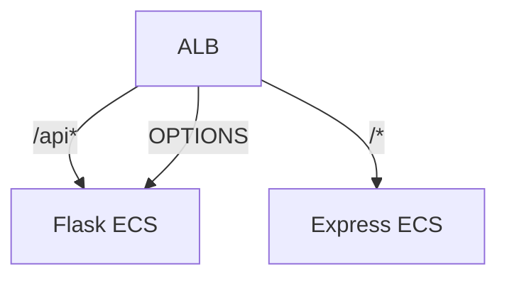

# Flask + Express ECS Deployment

This Terraform project deploys:
- Flask backend (port 5000)
- Express frontend (port 3000)
- Application Load Balancer with path-based routing

## Architecture


## Setup
```bash
# Initialize Terraform
terraform init

# Deploy infrastructure
terraform apply

# Push new Docker images
./deploy.sh
```

## Endpoints
- Frontend: `http://<ALB_DNS>/`
- API: `http://<ALB_DNS>/api`
- Submit: `POST http://<ALB_DNS>/submit`

## Troubleshooting
```bash
# Check ALB health
aws elbv2 describe-target-health --target-group-arn $(aws elbv2 describe-target-groups --names flask-tg --query 'TargetGroups[0].TargetGroupArn' --output text)

# View ECS logs
aws logs tail /ecs/my-cluster --follow
```
